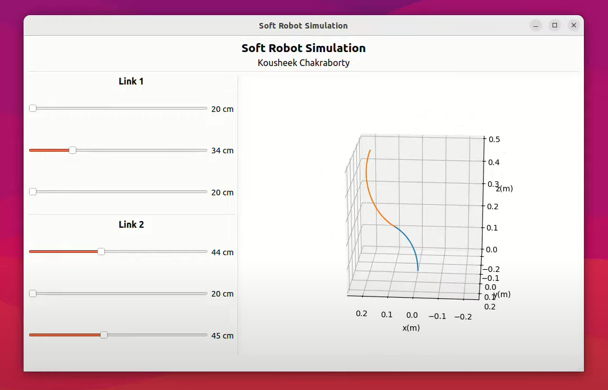

# Soft Robot Simulation

## About The Project
Soft robot simulation application created using PySide6 and Matplotlib3D. The soft robot consists of 2 independent links with 3 cable-driven actuators each. A forward kinematics model is built based on the Piecewise Constant Curvature (PCC) method using Denavit Hartenberg formalism.

Video demo : [https://youtu.be/y35-mtUggE0](https://youtu.be/y35-mtUggE0)



### Prerequisites
* Python3
* Numpy
* Matplotlib
* PySide6

### Installation
To install the Soft Robot Simulation application:

```
git clone https://github.com/kousheekc/soft_robot_simulation.git
cd soft_robot_simulation
pip3 install -r requirements.txt
```

## Usage
Run the app using:
```
python3 main.py
```

You can then modify the sliders to see the model update in realtime.

## Contact
Kousheek Chakraborty - kousheekc@gmail.com

Project Link: [https://github.com/kousheekc/soft_robot_simulation.git](https://github.com/kousheekc/soft_robot_simulation.git)

